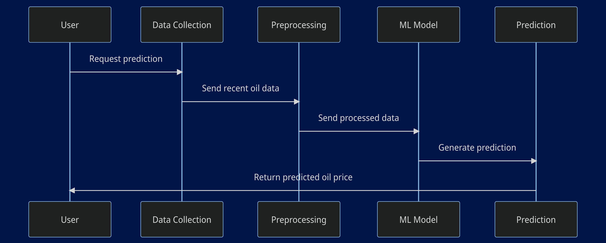
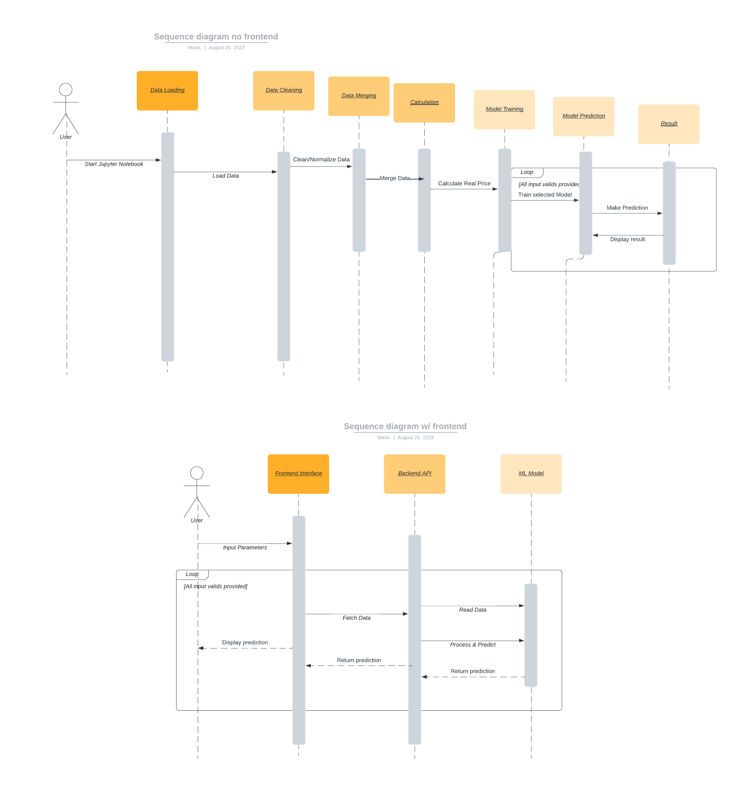
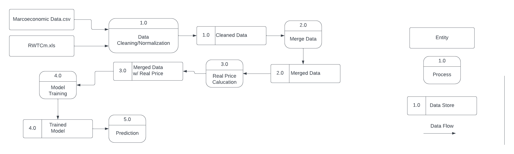
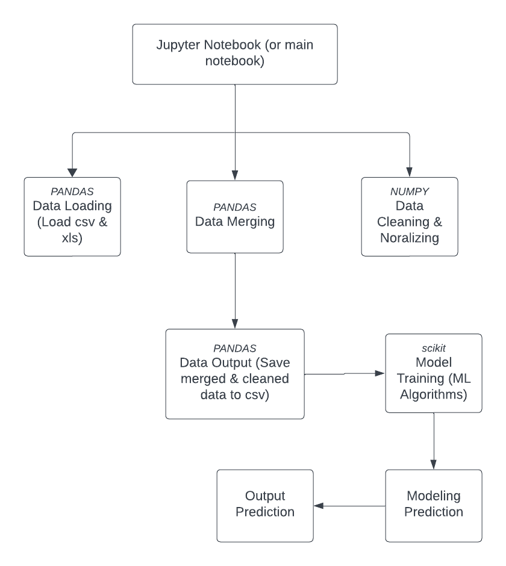

# Design Overview: Oil Price Prediction Project

Hello! In this document, we’re going to talk about how we designed our Oil Price Prediction Project from start to finish. It’s like when you sketch out your ideas before building something awesome – and that’s exactly what we did!

## Initial Thoughts and Sketches
When we first started this project, we knew we wanted to create something that could predict future oil prices, and we also wanted to share our findings through a web interface. So, we started by sketching out our ideas on paper. This helped us visualize our thoughts and communicate them with each other.

### Sequence Diagrams: Version 1 and Version 2
We created two sequence diagrams to help us understand how different parts of our project would interact with each other.

1. **Sequence Diagram V1**: This was our initial concept. It showed how the user would interact with our model, inputting data and receiving predictions. 

2. **Sequence Diagram V2**: This was our initial concept with the idea of a frontend web interface. It showed how the user would interact with our model through the web interface, inputting data and receiving predictions.

### Data Flow Diagram: Model Training Process
Next, we needed to understand how data would move through our system, especially during the model training process. So, we drew a Data Flow Diagram (DFD) to visualize this. It showed how data would be inputted, processed, and outputted, helping us ensure that every piece of data was accounted for and properly handled.

### Program Structure Diagram: Model Training Process
Finally, we wanted to map out the structure of our program, focusing on the model training process. We created a Program Structure Diagram to do this. It outlined the main components of our system, how they were connected, and how data would flow between them. This helped us ensure that our program was organized and efficient.

## Design Evolution and Lessons Learned
As we worked on our project, we learned a lot and made adjustments to our design. We realized that clear and detailed planning at the start could save us a lot of time and confusion later on. We also learned the importance of being flexible and open to changes, especially when incorporating new features like the web interface.

## Final Thoughts
In the end, our design process was a crucial part of our project. It helped us understand our own ideas, communicate with each other, and build a solution that we’re really proud of. And we hope that by sharing this overview, you can get a glimpse into how we turned our sketches and diagrams into a real, working project!

Happy exploring and designing!
